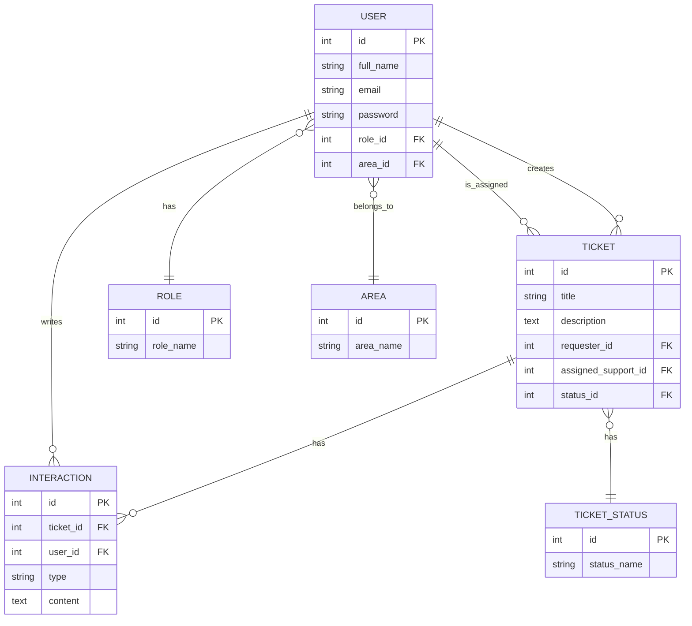
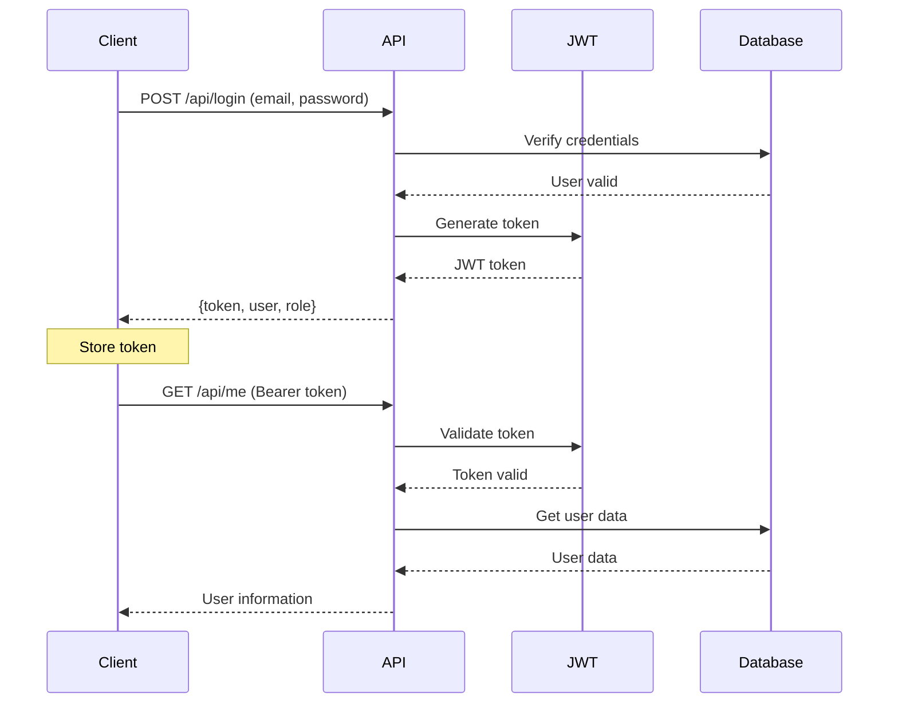

<p align="center">
  <a href="https://laravel.com" target="_blank">
    
  </a>
</p>

<p align="center">
  <a href="https://github.com/laravel/framework/actions"></a>
  <a href="https://packagist.org/packages/laravel/framework"></a>
  <a href="https://packagist.org/packages/laravel/framework"></a>
  <a href="https://packagist.org/packages/laravel/framework"></a>
</p>

---

## 📌 About Fixi Backend

This is the **backend of Fixi**, built with **Laravel 10**. It handles:

- 👥 User management (clients and support staff)
- 🔐 JWT-based authentication
- 🎫 Ticket and interaction management
- 🏢 Roles and areas management
- 🚀 REST API for frontend consumption

---

## 🛠 Technologies Used

- **Framework:** Laravel 10
- **Language:** PHP 8.x
- **Database:** PostgreSQL (compatible with MySQL)
- **Authentication:** JWT via [tymon/jwt-auth](https://github.com/tymondesigns/jwt-auth)
- **Middleware:** Custom JWT authentication

---

## 🚀 Installation

### 1. Clone repository

```bash
git clone https://github.com/tuusuario/fixi-backend.git
cd fixi-backend
```

### 2. Install dependencies

```bash
composer install
```

### 3. Copy environment file

```bash
cp .env.example .env
```

### 4. Configure .env

Edit `.env` with your database credentials and JWT secret:

```env
DB_CONNECTION=pgsql
DB_HOST=127.0.0.1
DB_PORT=5432
DB_DATABASE=fixi_db
DB_USERNAME=your_username
DB_PASSWORD=your_password

JWT_SECRET=your_jwt_secret_here
```

### 5. Generate application key

```bash
php artisan key:generate
```

### 6. Run migrations and seeders

```bash
php artisan migrate --seed
```

### 7. Start local server

```bash
php artisan serve
```

Backend will be available at `http://127.0.0.1:8000`

---

## 🔑 Authentication

### Endpoints

- **Login:** `POST /api/login`
- **Register User:** `POST /api/register-user`
- **Register Support:** `POST /api/register-support`

### Protected Routes

All protected routes require the header:

```
Authorization: Bearer {token}
```

### Example: Login

**Request:**

```bash
POST /api/login
Content-Type: application/json

{
  "email": "andres@gmail.com",
  "password": "password123"
}
```

**Response:**

```json
{
  "token": "eyJ0eXAiOiJKV1QiLCJh...",
  "role": "Support",
  "user": {
    "id": 1,
    "full_name": "Andres Carvajal",
    "email": "andres@gmail.com"
  }
}
```

---

## 📂 Project Structure

```
app/
├── Http/
│   ├── Controllers/        # API controllers
│   ├── Middleware/         # CustomAuthenticate
├── Models/                 # Eloquent models
database/
├── migrations/             # Database migrations
├── seeders/                # Seeders for initial data
routes/
├── api.php                 # API routes
```

---

## 🗄️ Models and Relationships

### Main Models

| Model        | Description                          |
| ------------ | ------------------------------------ |
| User         | Users (clients and support)          |
| Role         | User roles (User, Support)           |
| Area         | User working areas                   |
| Ticket       | Tickets created by users             |
| TicketStatus | Ticket statuses (open, in_progress…) |
| Interaction  | Comments or updates on tickets       |

### Key Relationships

- **User** belongs to **Role** and **Area**
- **User** can have many `requestedTickets` or `assignedTickets`
- **Ticket** belongs to `requester`, `assignedSupport`, `status`
- **Ticket** has many `interactions`
- **Interaction** belongs to **User** and **Ticket**

### Entity Relationship Diagram



---

## ⚙️ Controllers and Functions

### LoginController

| Method     | Description                       |
| ---------- | --------------------------------- |
| `login()`  | Authenticate user, return JWT     |
| `logout()` | Invalidate token                  |
| `refresh()` | Refresh token                     |
| `me()`     | Get authenticated user            |

### UserController

| Method            | Description                       |
| ----------------- | --------------------------------- |
| `index()`         | List users with role and area     |
| `show($id)`       | Get specific user                 |
| `storeUser()`     | Register client user              |
| `storeSupport()`  | Register support user with code   |
| `update($id)`     | Update user                       |
| `destroy($id)`    | Delete user                       |

### TicketController

| Method         | Description                              |
| -------------- | ---------------------------------------- |
| `index()`      | List tickets (users see only their own)  |
| `show($id)`    | Get ticket details                       |
| `store()`      | Create ticket                            |
| `update($id)`  | Update ticket                            |
| `assign($id)`  | Assign ticket to support                 |
| `destroy($id)` | Delete ticket (support only)             |

### InteractionController

| Method            | Description               |
| ----------------- | ------------------------- |
| `index($ticketId)` | List ticket interactions  |
| `store()`         | Create interaction        |
| `show($id)`       | Get specific interaction  |
| `update($id)`     | Update interaction        |
| `destroy($id)`    | Delete interaction        |

### Other Controllers

- **AreaController:** Basic CRUD for areas
- **RoleController:** List and show roles
- **TicketStatusController:** List and show statuses

---

## 🔗 API Routes

### Public Routes

```
POST   /api/login
POST   /api/register-user
POST   /api/register-support
```

### Protected Routes (require JWT token)

```
GET    /api/me
POST   /api/logout
POST   /api/refresh
```

### Resource Routes

| Method | Endpoint                           | Description              |
| ------ | ---------------------------------- | ------------------------ |
| GET    | /api/tickets                       | List all tickets         |
| POST   | /api/tickets                       | Create ticket            |
| GET    | /api/tickets/{id}                  | Show ticket              |
| PUT    | /api/tickets/{id}                  | Update ticket            |
| DELETE | /api/tickets/{id}                  | Delete ticket            |
| POST   | /api/tickets/{id}/assign           | Assign ticket to support |
| GET    | /api/tickets/{ticketId}/interactions | List interactions        |
| POST   | /api/interactions                  | Create interaction       |
| GET    | /api/interactions/{id}             | Show interaction         |
| GET    | /api/users                         | List users               |
| POST   | /api/users                         | Create user              |
| GET    | /api/users/{id}                    | Show user                |
| PUT    | /api/users/{id}                    | Update user              |
| DELETE | /api/users/{id}                    | Delete user              |
| GET    | /api/areas                         | List areas               |
| GET    | /api/roles                         | List roles               |
| GET    | /api/ticket-statuses               | List ticket statuses     |

---

## 💡 Example Usage

### Using Axios (JavaScript)

```javascript
import axios from "axios";

// Configure base URL
const api = axios.create({
  baseURL: "http://127.0.0.1:8000/api",
  headers: {
    "Content-Type": "application/json"
  }
});

// Login
const login = async (email, password) => {
  try {
    const response = await api.post("/login", { email, password });
    const { token, user, role } = response.data;
    
    // Save token
    localStorage.setItem("token", token);
    
    // Set token for future requests
    api.defaults.headers.common["Authorization"] = `Bearer ${token}`;
    
    return { user, role };
  } catch (error) {
    console.error("Login error:", error);
    throw error;
  }
};

// Get authenticated user
const getMe = async () => {
  const token = localStorage.getItem("token");
  const response = await api.get("/me", {
    headers: {
      Authorization: `Bearer ${token}`
    }
  });
  return response.data;
};

// Create ticket
const createTicket = async (title, description) => {
  const token = localStorage.getItem("token");
  const response = await api.post("/tickets", 
    { title, description },
    {
      headers: {
        Authorization: `Bearer ${token}`
      }
    }
  );
  return response.data;
};
```

### Using cURL

```bash
# Login
curl -X POST http://127.0.0.1:8000/api/login \
  -H "Content-Type: application/json" \
  -d '{"email":"andres@gmail.com","password":"password123"}'

# Get authenticated user
curl -X GET http://127.0.0.1:8000/api/me \
  -H "Authorization: Bearer YOUR_TOKEN_HERE"

# Create ticket
curl -X POST http://127.0.0.1:8000/api/tickets \
  -H "Authorization: Bearer YOUR_TOKEN_HERE" \
  -H "Content-Type: application/json" \
  -d '{"title":"Issue with login","description":"Cannot access my account"}'
```

---

## 🔄 Authentication Flow



---

## 🧪 Testing

### Run tests

```bash
php artisan test
```

### Create a test

```bash
php artisan make:test TicketTest
```

### Example test

```php
<?php
namespace Tests\Feature;

use Tests\TestCase;
use App\Models\User;
use Illuminate\Foundation\Testing\RefreshDatabase;

class TicketTest extends TestCase
{
    use RefreshDatabase;

    public function test_user_can_create_ticket()
    {
        $user = User::factory()->create();
        $token = auth()->login($user);

        $response = $this->withHeaders([
            'Authorization' => 'Bearer ' . $token,
        ])->postJson('/api/tickets', [
            'title' => 'Test Ticket',
            'description' => 'This is a test ticket'
        ]);

        $response->assertStatus(201)
                 ->assertJsonStructure(['id', 'title', 'description']);
    }
}
```

---

## 🔧 Best Practices

- ✅ Use **Form Requests** for complex validation
- ✅ Maintain consistent naming for routes and controllers
- ✅ Handle exceptions in `app/Exceptions/Handler.php`
- ✅ Keep support codes and secrets in `.env`
- ✅ Use **Eloquent relationships** instead of manual joins
- ✅ Implement **rate limiting** on sensitive routes
- ✅ Always validate and sanitize user input

---

## 🔐 Security

- JWT tokens with expiration
- Password hashing with `bcrypt`
- Custom authentication middleware
- Role-based access control
- Input validation on all endpoints
- CORS configuration for frontend

---

## 📖 Resources

- [Laravel Documentation](https://laravel.com/docs/10.x)
- [JWT Auth Package](https://github.com/tymondesigns/jwt-auth)
- [Eloquent ORM](https://laravel.com/docs/10.x/eloquent)
- [API Resources](https://laravel.com/docs/10.x/eloquent-resources)

---

## 🤝 Contributing

Thank you for considering contributing to this project! Please follow these steps:

1. Fork the repository
2. Create your feature branch (`git checkout -b feature/AmazingFeature`)
3. Commit your changes (`git commit -m 'Add some AmazingFeature'`)
4. Push to the branch (`git push origin feature/AmazingFeature`)
5. Open a Pull Request

For more details, check the [Laravel contribution guide](https://laravel.com/docs/contributions).

---

## 📜 Code of Conduct

Please ensure the Laravel community remains welcoming by following the [Code of Conduct](https://laravel.com/docs/contributions#code-of-conduct).

---

## 🔒 Security Vulnerabilities

If you discover a security vulnerability, please send an e-mail to the project maintainer.

---

## 📄 License

This project and the Laravel framework are open-sourced software licensed under the [MIT license](https://opensource.org/licenses/MIT).

---

**Built with ❤️ using Laravel**
